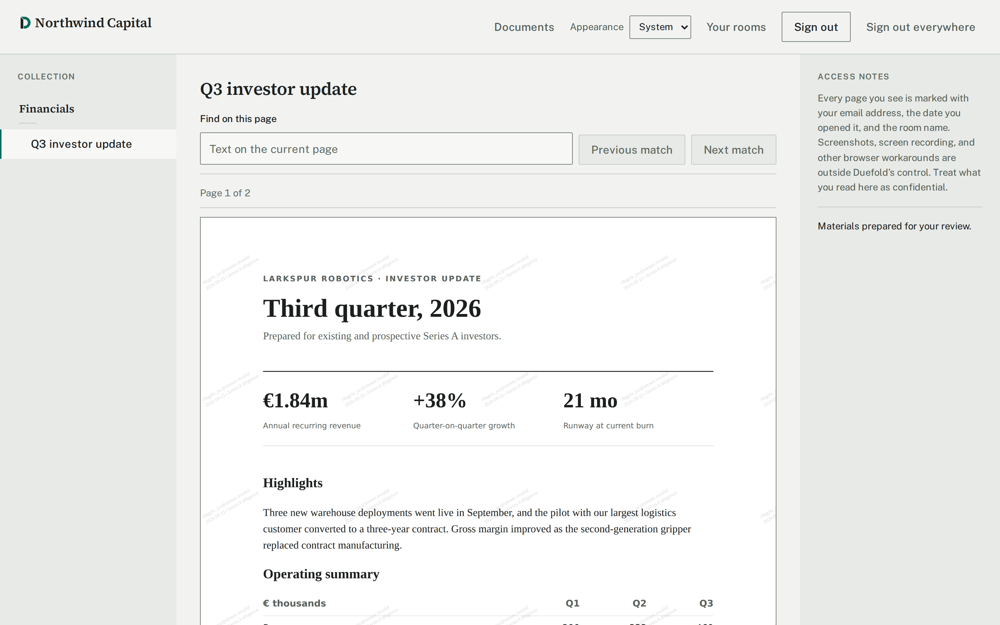
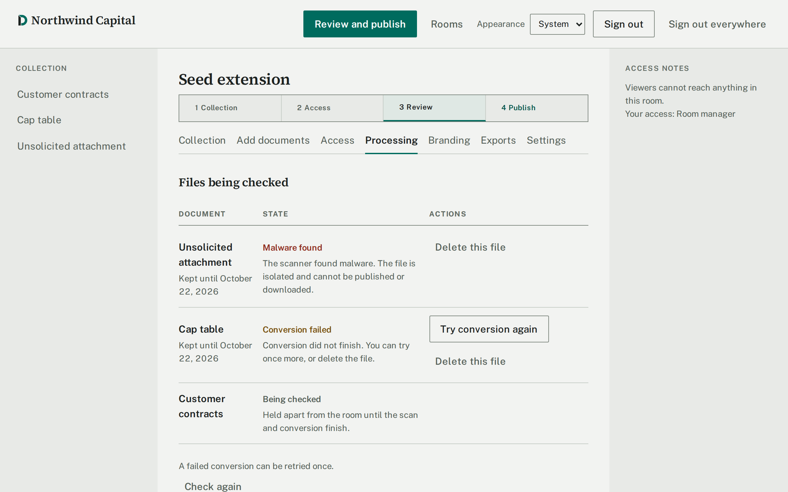
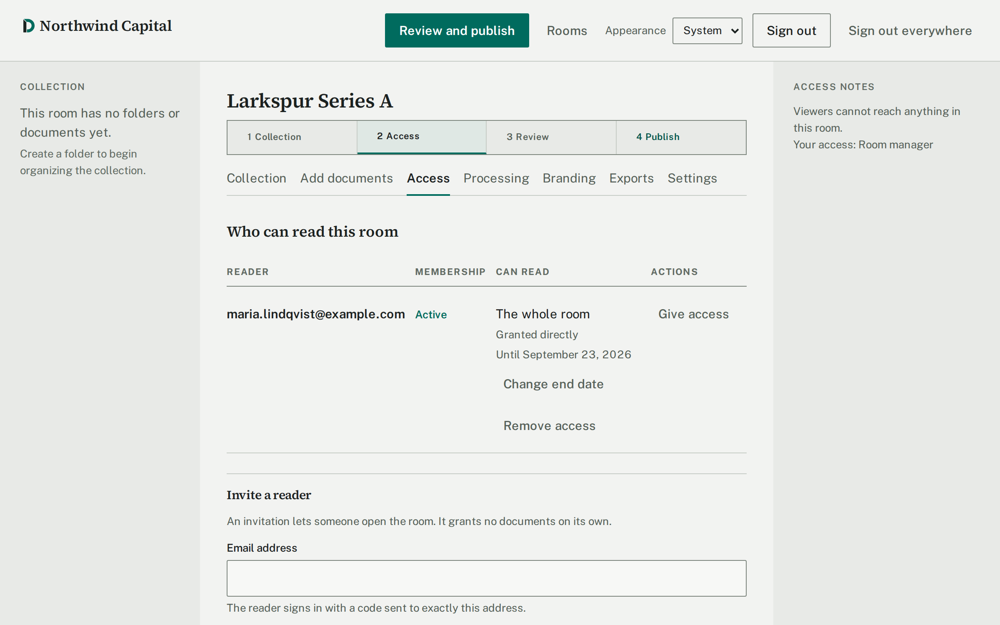
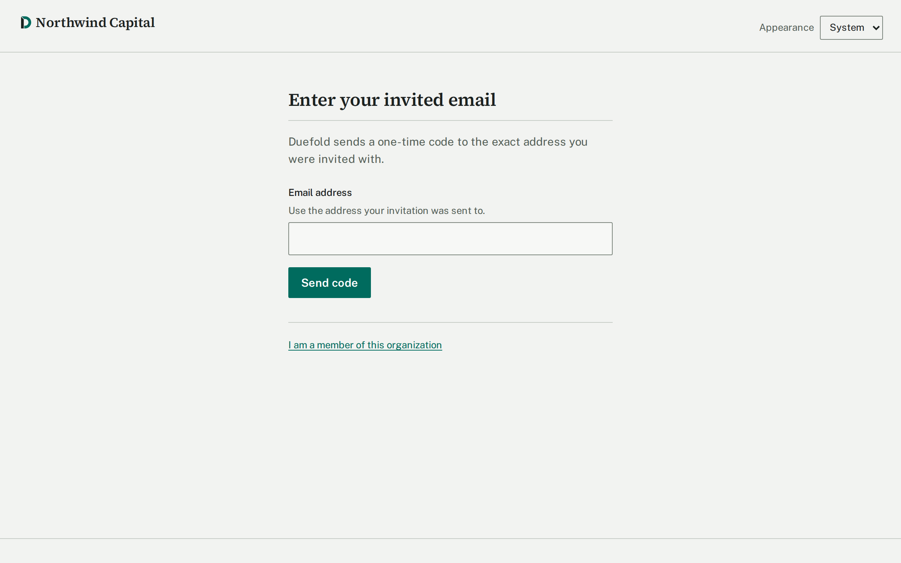
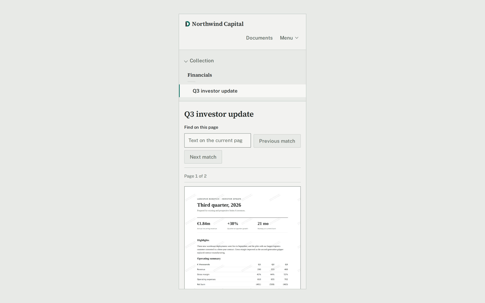

<div align="center">

<h1>
<picture>
  <source media="(prefers-color-scheme: dark)" srcset="apps/web-client/public/brand/logo-dark.svg">
  
</picture>
</h1>

**The investor data room you run yourself.**

Built by a founder, for founders. 100% free and open source.

[](LICENSE)
[](docs/self-hosting.md)

</div>

<picture>
  <source media="(prefers-color-scheme: dark)" srcset="docs/images/reading-room-dark.png">
  
</picture>

Share your cap table, financial model, and contracts with investors without a link anyone can forward or a data room priced for investment banks. Duefold runs on your own infrastructure and does what a fundraise needs, nothing more.

## Features

- **Invite people, not links.** Investors sign in with a one-time code sent to their email. A forwarded invitation lets nobody else in.
- **Publish when you're ready.** Investors see nothing until you publish it.
- **Simple permissions.** Give a person or a whole firm access to a room, a folder, or a single document, until a date you choose.
- **Safe previews.** Every upload is virus-scanned and converted in an isolated sandbox. Investors read documents in the browser.
- **Watermarks.** Every page shows the reader's email, the date, and the room.
- **Download control.** Allow or block downloads per document.
- **Audit log.** See who opened what, and export it.
- **Your data stays yours.** Your own PostgreSQL database and S3-compatible storage.

Works on phones, in dark mode, and with a keyboard or screen reader.

<table>
  <tr>
    <td width="50%" valign="top">
      
      <p>Every upload is scanned before it can be published.</p>
    </td>
    <td width="50%" valign="top">
      
      <p>See who can read what, and until when.</p>
    </td>
  </tr>
  <tr>
    <td width="50%" valign="top">
      
      <p>Investors sign in with an email code. No passwords.</p>
    </td>
    <td width="50%" valign="top">
      
      <p>The same reading room on a phone.</p>
    </td>
  </tr>
</table>

## Get started

On your own server with Docker Compose:

```sh
git clone https://github.com/vaip441/duefold.git && cd duefold
cp .env.example .env    # your domain, sign-in, mail, and storage settings
docker compose up -d
```

The [self-hosting guide](docs/self-hosting.md) walks through each setting.

Before choosing another host, read the [host requirements](docs/host-requirements.md): the document sandbox needs kernel features that many managed platforms don't grant. The [Railway + Cloudflare R2 + Resend](docs/railway-deployment.md) guide is for evaluation with synthetic data only, because Railway can't provide that sandbox.

## Good to know

- Watermarks discourage leaks. They can't stop a phone camera.
- A file that has been downloaded can't be recalled.
- The audit log is append-only, but someone with direct database access could still change it.

Duefold deliberately leaves out NDAs, Q&A, engagement analytics, and DRM.

## Security

Read the [threat model](docs/security/threat-model.md), [data flow and trust boundaries](docs/security/data-flow.md), [ASVS map](docs/security/asvs-map.md), and [incident-response runbook](docs/security/incident-response.md). Report vulnerabilities privately as described in [SECURITY.md](SECURITY.md).

## Contributing

Issues and pull requests are welcome. See [CONTRIBUTING.md](CONTRIBUTING.md).

## License

Copyright (C) 2026 Georg Kalme. Licensed under the [GNU AGPL v3.0](LICENSE): free to use and modify for your company. If you offer a modified version to others over a network, you must share your changes.
